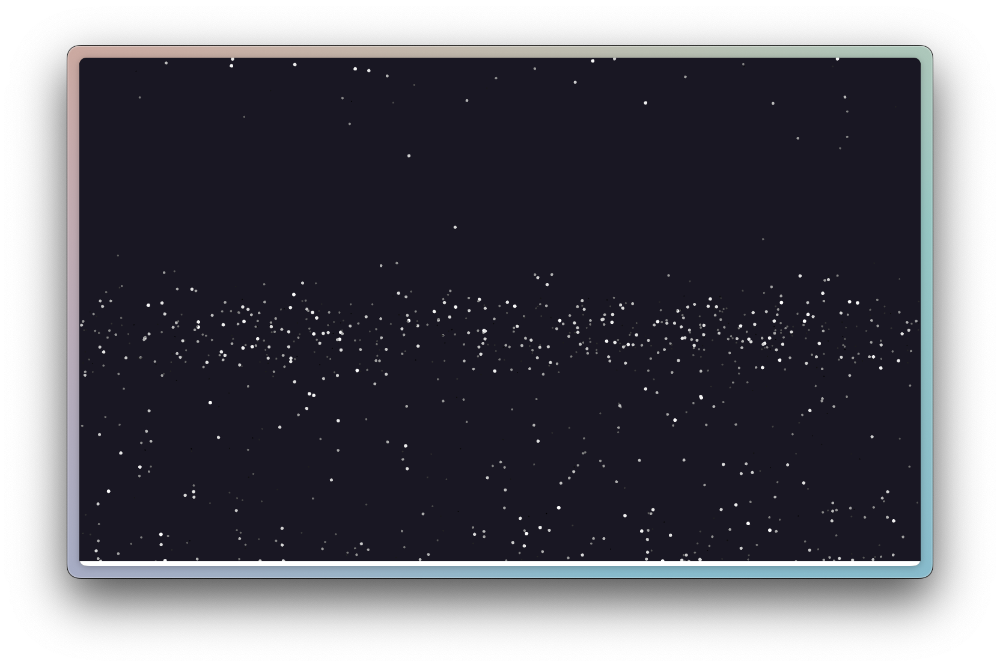
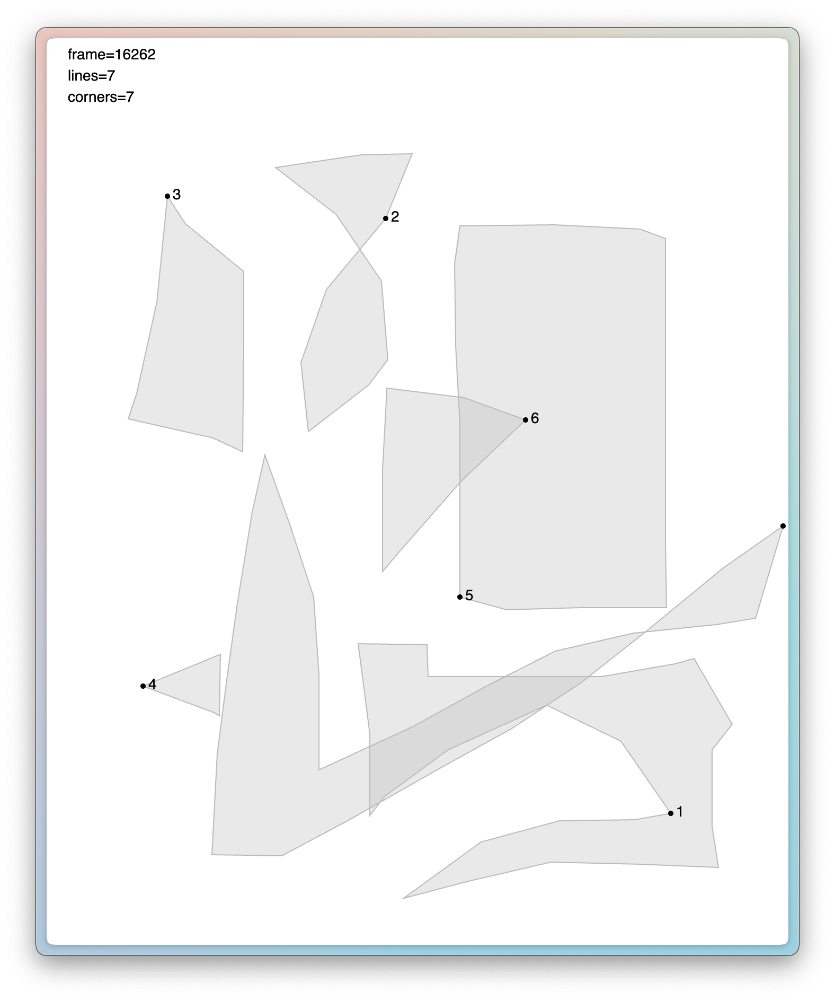
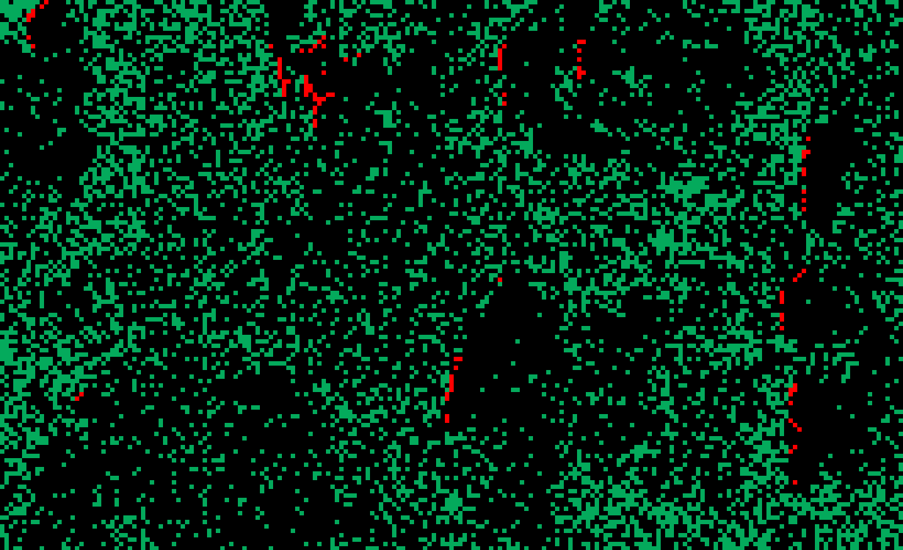
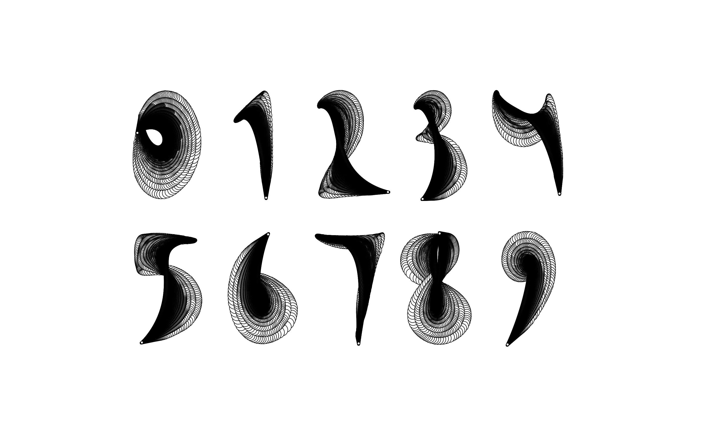
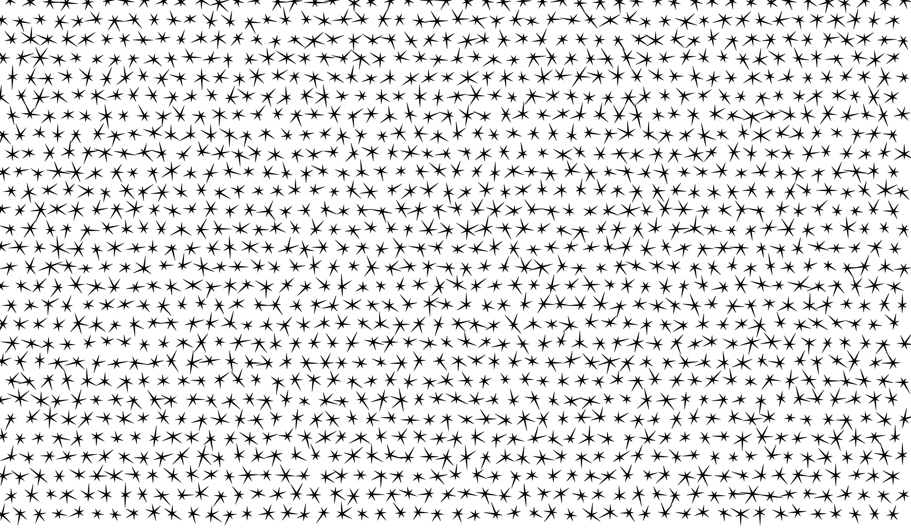
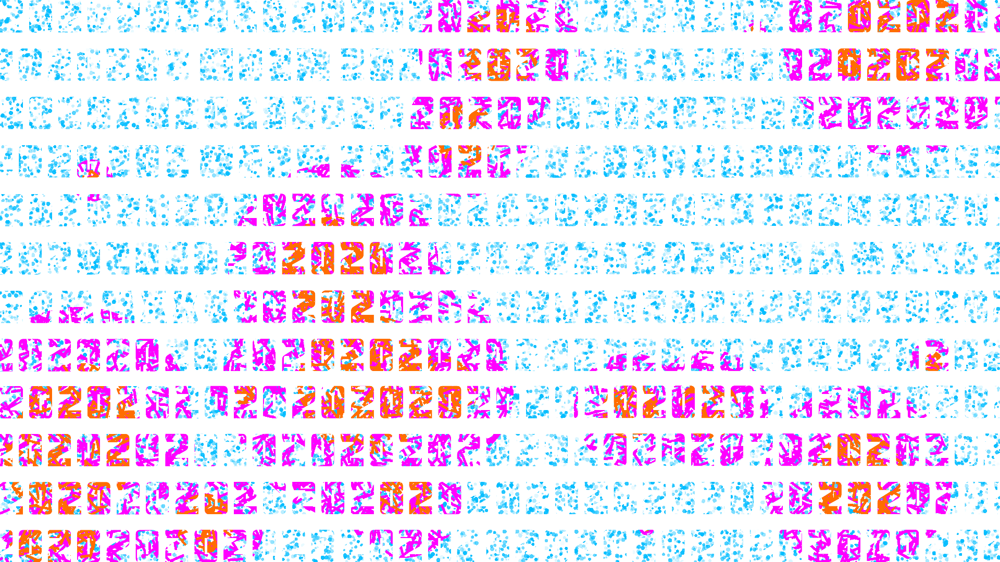
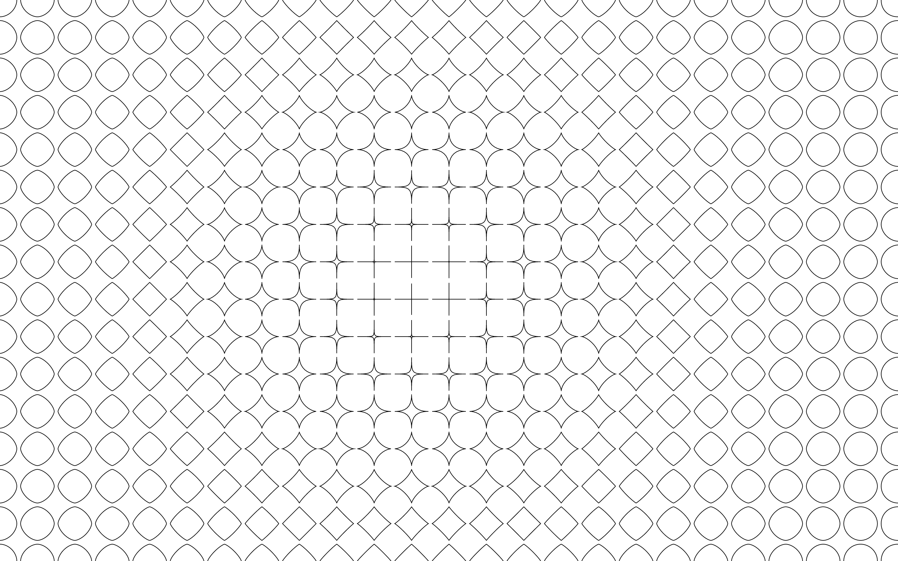

# Popcode

## [`Sketch 20231124`](https://tmshv.github.io/popcode/sketch_20231124)

## [`Sketch 20231104`](https://tmshv.github.io/popcode/sketch_20231104)

## [`Forest Fire Cellular Automata`](https://tmshv.github.io/popcode/fire_ca)

## [`Sketch 0001`](https://tmshv.github.io/popcode/sketch_0001)

## [`20200622-digits`](https://tmshv.github.io/popcode/20200622-digits)

## [`unit4_z4`](https://tmshv.github.io/popcode/unit4_z4)

## [`pattern_0003`](https://tmshv.github.io/popcode/pattern_0003)

## [`HNY2020`](https://tmshv.github.io/popcode/hny2020)

## [`pattern_0002`](https://tmshv.github.io/popcode/pattern_0002)

## [`pattern_0001`](https://tmshv.github.io/popcode/pattern_0001)

## [`superellipse`](https://tmshv.github.io/popcode/superellipse)

## [`heterotopia`](https://tmshv.github.io/popcode/heterotopia)

## [`unit4_z3`](https://tmshv.github.io/popcode/unit4_z3)

## [`rd_simulation` ](https://tmshv.github.io/popcode/rd_simulation)

## [`8m19_pattern` ](https://tmshv.github.io/popcode/8m19_pattern)

